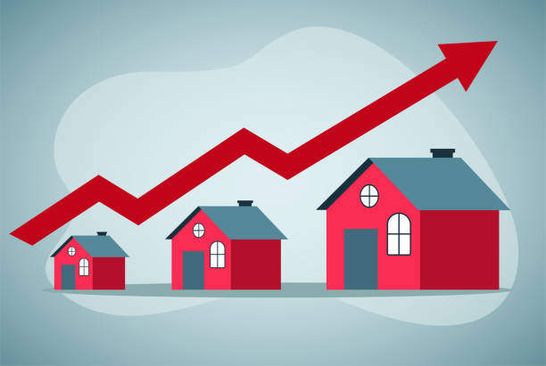
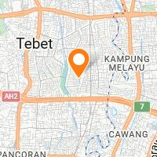
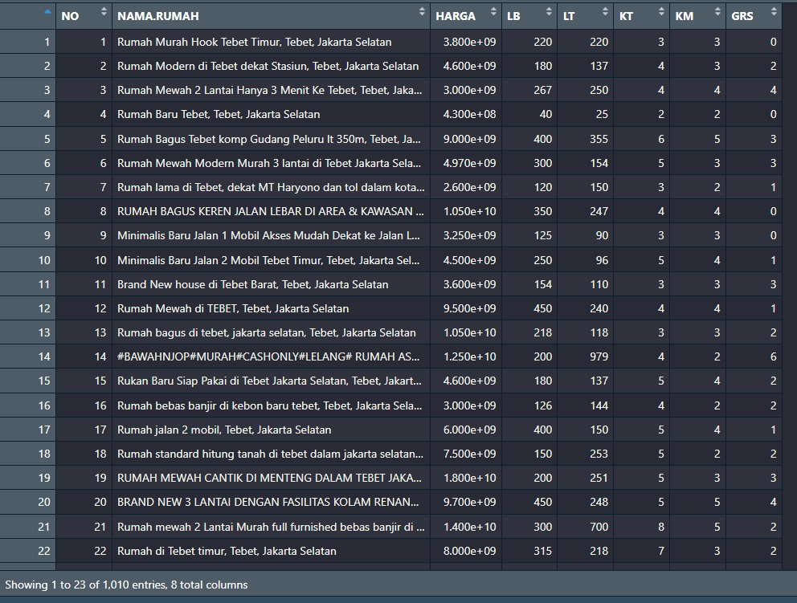
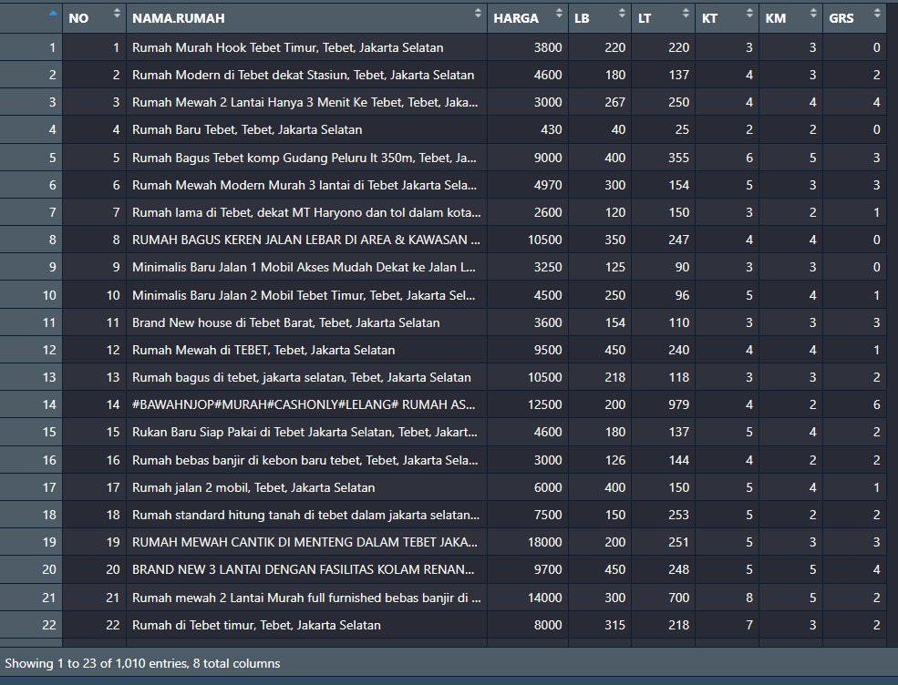
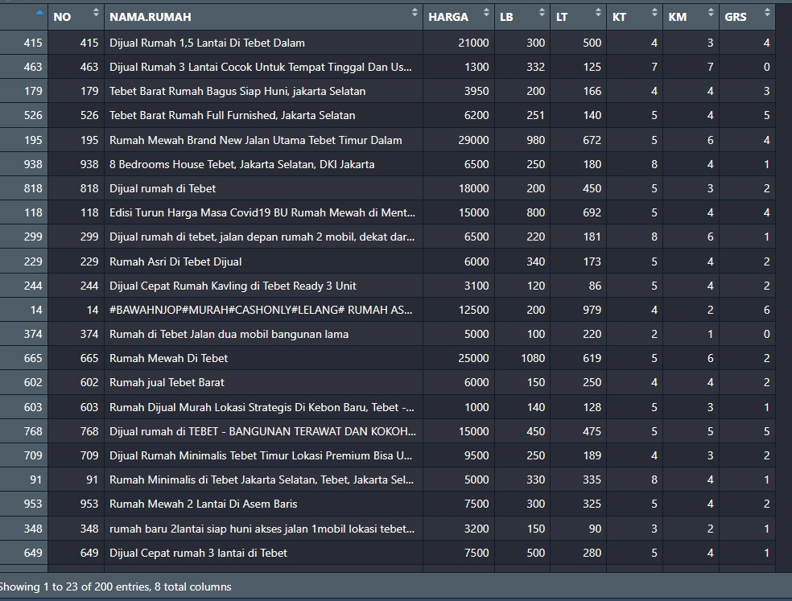
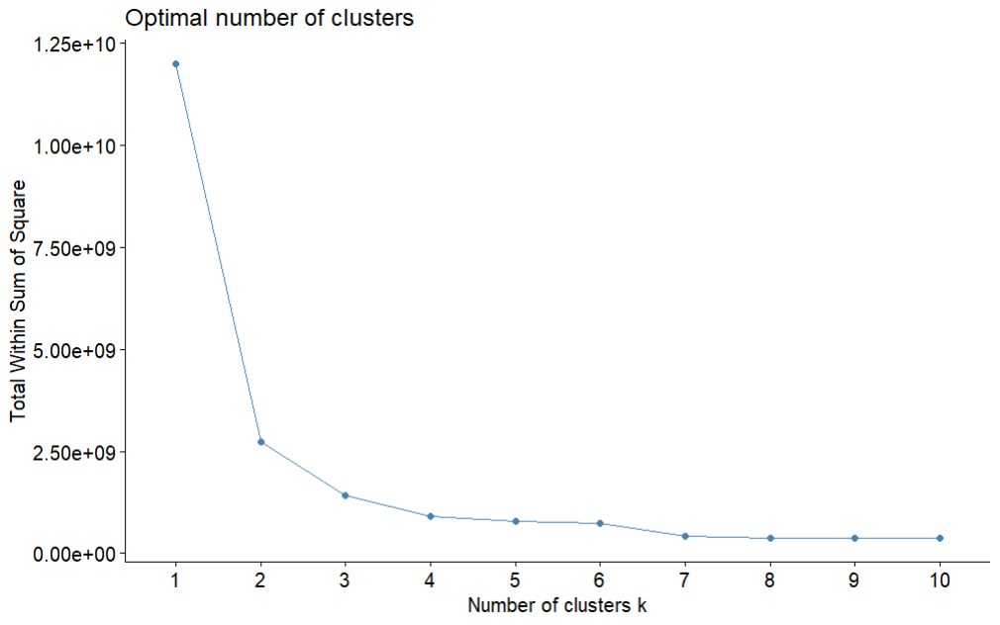
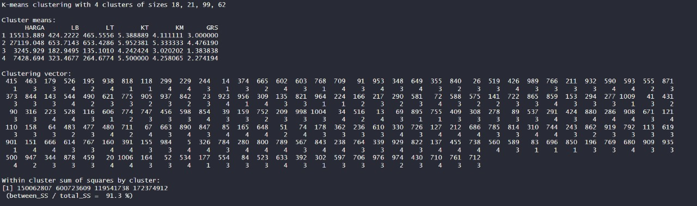
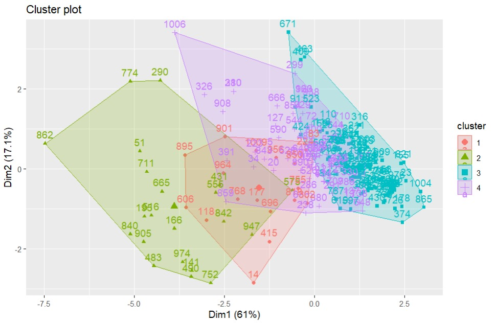
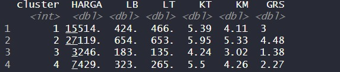
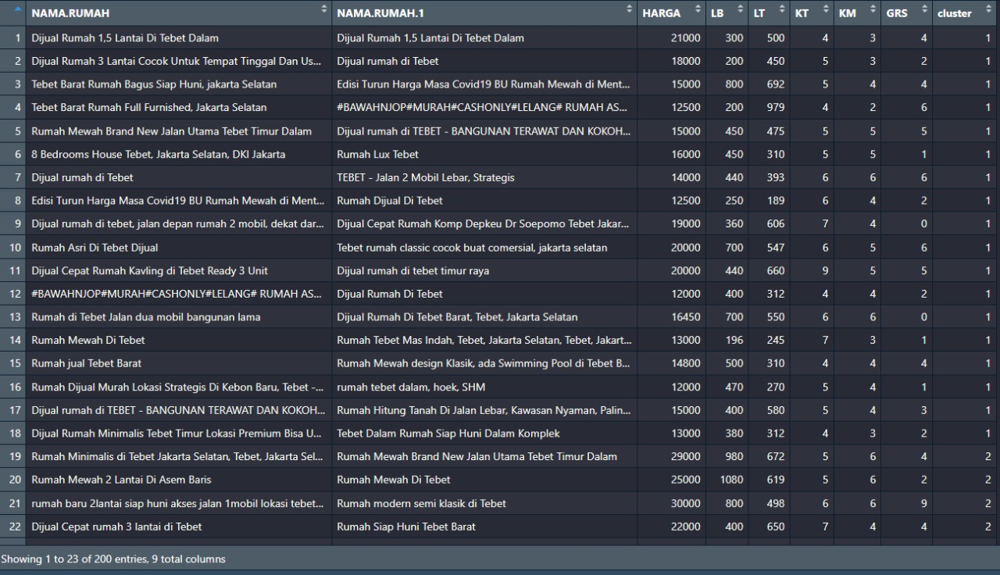

  

  
  
  

  

  Visualisasi dan Metode Klastering data Harga Rumah yang dijual di Tebet, Jakarta Selatan 2020.
    
  <em>Dataset by <a href="https://kaggle.com">Kaggle</a>.</em>

    
# Latar Belakang

[House Price Clustering](https://github.com/habibarrsyd/tebest-hous-price-clustering) 
Daerah DKI Jakarta memiliki peranan yang sangat penting dalam menopang roda pergerakan ekonomi, sehingga menyebabkan ekspansi pemanfaatan ruang pada daerah ini. Akibatnya seiring bertambahnya tahun lahan tersedia semakin sedikit, harga tanah per meter persegi juga semakin tinggi. Dengan demikian untuk orang yang ingin mencari tempat tinggal di daerah ini diperlukan adanya referensi agar biaya yang mereka sediakan mendapatkan sepantasnya tempat tinggal. Dengan adanya klastering terhadap rumah-rumah yang dijual dan dengan metode k-means maka langkah ini dapat memberi solusi untuk orang yang ingin mencari tempat tinggal di daerah ini.

## Tools
[`^ kembali ke atas ^`](#)

### Software yang digunakan :
- Sistem Operasi: Linux Ubuntu/Windows/Mac OS
- Bahasa : R Language Programming
- Text Editor : R Studio atau Visual Studio Code

### Proses :
#### Baca Data
- 
#### Bagi harga dengan integer 1000000 untuk mempermudah pembacaan
- 
#### Ambil data yang dapat mewakili populasi yang akan dilakukan klastering
- 
#### Gunakan elbow method untuk menentukan banyak klaster
- 
#### Gunakan Kmeans 4 Klaster
- 
#### Visualisasi Plot Klaster
- 
#### Tunjukkan klaster terbentuk
- 
#### Data rumah yang sudah ter-klaster
- 

